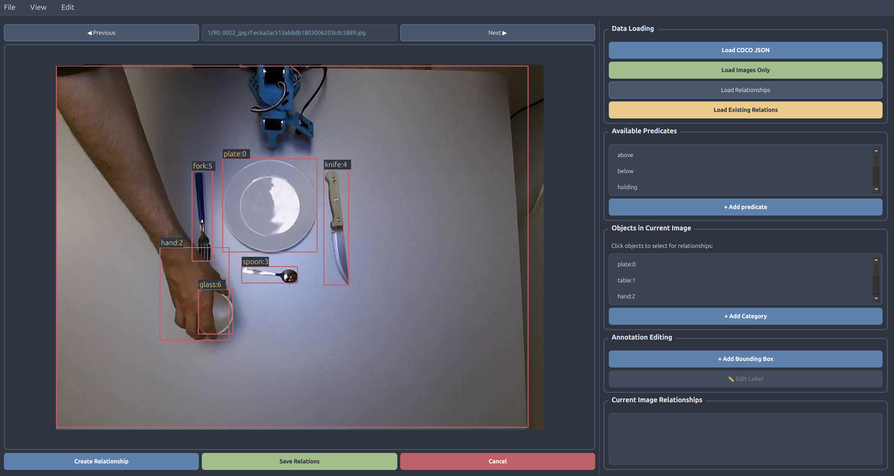

# SGG-Annotate - Scene Graph Annotation tool (COCO format)

A modern annotation tool for annotating visual relationships in COCO format.



## 🚀 Quick Start

### Option 1: PyQt6 Version (Recommended - Modern UI)
```bash
# Install dependencies
pip install -r requirements.txt

# Run
python main_coco_pyqt.py --output name_of_output_file.json
```

### Option 2: Tkinter Version (Fallback - Classic UI)
```bash
# Run tkinter version
python main_coco.py --output name_of_output_file.json
```

## ✨ Features

### Core Features
- 📝 **COCO Format Support**: Load existing COCO JSON annotations
- 🔗 **Relationship Annotation**: Create subject-predicate-object relationships
- 🎯 **Object Selection**: Click or list-based object selection
- 💾 **Multiple Export Formats**: COCO, JSON, and TXT outputs
- ⌨️ **Keyboard Shortcuts**: Efficient workflow navigation

### PyQt6 Version Features
- 🌙 **Modern Dark Theme**: Nord color scheme
- 🎨 **Custom Styled Components**: Professional UI elements
- 🖼️ **Advanced Canvas**: Smooth image rendering with bounding boxes
- 📱 **Responsive Layout**: Splitter-based resizable panels
- 🎮 **Enhanced Dialogs**: Modern predicate selection

### Tkinter Version Features
- 🔄 **Fallback Compatibility**: Works without PyQt6
- 📋 **Dialog System**: Custom dialog components
- 🖱️ **Advanced Selection**: Shift+click unselection support
- 📏 **4K Display Support**: Adaptive dialog sizing

## 🛠️ Installation

### Prerequisites
- Python 3.7+
- PIL/Pillow for image processing

### Install PyQt6 Version (Recommended)
```bash
pip install -r requirements.txt
```

## 🎯 Usage

### 0. (Optional) Annotate Bounding Boxes

- It is recommended to annotate the bounding boxes with an external tool such as [https://roboflow.com/](https://roboflow.com/). Roboflow is more practical for bounding box annotations and will save time with big datasets. You can also annotate bounding boxes with SGG-Annotate but it will be less efficient.
- Once you have created your dataset, export bounding box annotations in COCO format (json file).

### 1. Load COCO Data
- Click "Load COCO JSON" and select your COCO annotations file
- Select the folder containing your images

### 2. Load Relationships
- Click "Load Relationships" and select a text file with relationship types
- File should contain one relationship per line (e.g., "on", "under", "next to")

### 3. Create Relationships
- Click "Create Relationship" to enter annotation mode
- Select subject object (highlighted in blue)
- Select object object (highlighted in green)
- Choose predicate from the dialog

### 4. Save Results
- Click "Save Relations" to export in multiple formats
- Files saved to `output_coco_relations/` directory

## ⌨️ Keyboard Shortcuts

| Key | Action |
|-----|--------|
| `Ctrl+O` | Load COCO JSON |
| `Ctrl+R` | Load Relationships |
| `Ctrl+S` | Save Relationships |
| `Ctrl+T` | Toggle Relation Mode |
| `Escape` | Cancel Operation |
| `Left/Right` | Navigate Images |
| `Space` | Save Current |

## 📊 Output Formats

### COCO Format
Enhanced COCO JSON with `rel_annotations` and `rel_categories` fields:
```json
{
  "rel_annotations": [
    {
      "id": 0,
      "subject_id": 123,
      "predicate_id": 1,
      "object_id": 456,
      "image_id": 789
    }
  ],
  "rel_categories": [
    {"id": 0, "name": "on"},
    {"id": 1, "name": "under"}
  ]
}
```

This format of annotations can be use with the [SGG-Benchmark](https://github.com/Maelic/SGG-Benchmark) codebase to train SOTA SGG models.

## 🏗️ Architecture

### PyQt6 Modular Design
```python
# Modern modular approach
from pyqt6_ui.main_window import COCORelationAnnotatorPyQt
from pyqt6_ui.components import ModernButton, ModernLabel
from pyqt6_ui.canvas import ImageCanvas
from pyqt6_ui.dialogs import PredicateSelectionDialog
```

## 🐛 Troubleshooting

### PyQt6 Not Available
```bash
# Falls back to tkinter version
python main_coco.py
```

### Image Loading Issues
- Ensure PIL/Pillow is installed: `pip install Pillow`
- Check image file formats (JPG, PNG supported)

### Large Images Performance
- Tool automatically scales images for display
- Original coordinates preserved for annotations

## 🤝 Contributing

1. Fork the repository
2. Create feature branch (`git checkout -b feature/AmazingFeature`)
3. Commit changes (`git commit -m 'Add AmazingFeature'`)
4. Push to branch (`git push origin feature/AmazingFeature`)
5. Open Pull Request